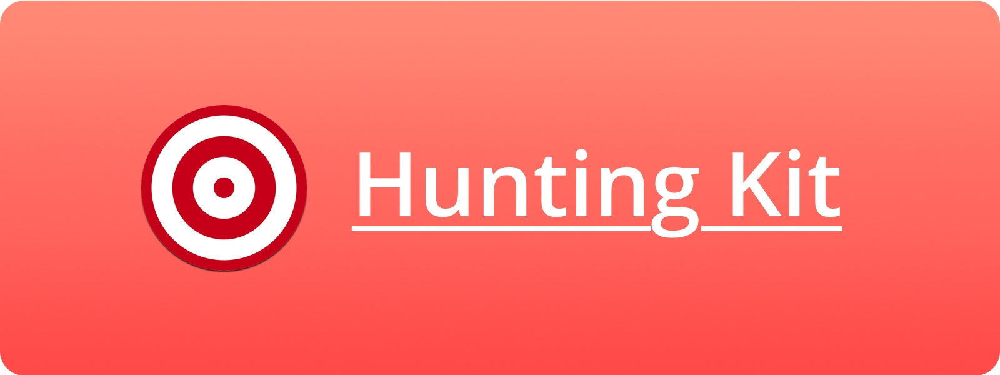

# HuntingKit
Wrapper for the Product Hunt API. Written in Swift and built on top of the [APIKit](https://github.com/ishkawa/APIKit) framework

<p align="center">
  
</p>

## Installation:

[Carthage](https://github.com/carthage/carthage) is the recommended way to install HuntingKit. Add the following to your Cartfile:

``` ruby
github "raulriera/HuntingKit"
```

It is important to note that iOS doesn't like umbrella framework, so make sure you import to your projects all the dependency frameworks.

## Demo:

For a full feature demostration please checkout the [HuntingCompanion](https://github.com/raulriera/HuntingCompanion) app.

## Usage:

Before you do anything, you need to get the credentials for your app

``` swift
let authenticationRequest = ProductHunt.Endpoint.ClientToken(id: "your-clientId", secret: "your-clientSecret")

ProductHunt.sendRequest(authenticationRequest) { response in
    switch response {
    case .Success(let box):
        // At this point HuntingKit has stored the credentials in your keychain, you are free to use any other endpoint available. You also have access to the `AccessToken` yourself.

    case .Failure(let box):
        // Handle your errors
    }
}
```

Now that you have the required permissions, let's get all the products for today

``` swift
let request = ProductHunt.Endpoint.Posts(from: .Today)

ProductHunt.sendRequest(request) { [unowned self] response in
    switch response {
    case .Success(let box):
        // By now you have the array of Posts (products) available to you

    case .Failure(let box):
        // Handle your errors
    }
}
```

As you can see, the framework uses `enum` for type safety. Make sure you explore the source code to see all the available options.

## Dependencies:

- [APIKit](https://github.com/ishkawa/APIKit) A networking library for building type safe web API client in Swift.

## About:
Created by Raul Riera, [@raulriera](http://twitter.com/raulriera)
